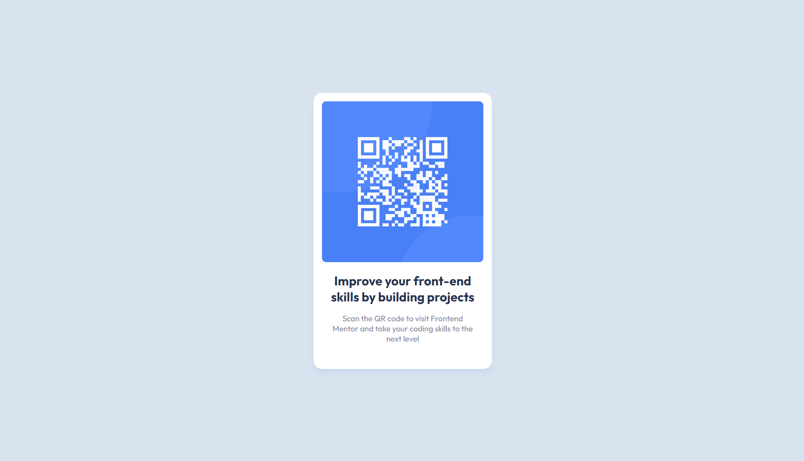

# Frontend Mentor - QR code component solution

This is a solution to the [QR code component challenge on Frontend Mentor](https://www.frontendmentor.io/challenges/qr-code-component-iux_sIO_H). Frontend Mentor challenges help you improve your coding skills by building realistic projects. 

## Table of contents

- [Overview](#overview)
  - [Screenshot](#screenshot)
- [My process](#my-process)
  - [Built with](#built-with)
  - [What I learned](#what-i-learned)
  - [Continued development](#continued-development)
- [Author](#author)
- [Acknowledgments](#acknowledgments)

## Overview

### Screenshot



## My process

### Built with

- Semantic HTML5 markup
- CSS custom properties
- CSS Grid
- Mobile-first workflow

### What I learned

This was my first project using Frontend Mentor and my first time really trying to change and improve my CSS. I learned a lot about setting up and using custom properties, using em and rem for relative sizing, and styling containers.

In the past I would have tried to style a card like the one in this project by hard-coding values for the card's width and height like this:

```css
.card {
  width: 300px;
  height: 600px;
}
```

For this project I tried using padding to set the dimensions of the card based on its content, which I think turned out better (looking for feedback if this is considered best practice or if it is better to stick with hard-coding the card's dimensions):

```css
.qr-card {
  --image-width: 305px;
  --card-padding: 1rem;

  padding: var(--card-padding);
  padding-bottom: calc(var(--card-padding) * 2);
  max-width: calc(var(--image-width) + 2 * var(--card-padding));
}
```

Because this was my first project really learning about custom properties, I didn't want to make the mistake of going overboard with it. Setting local custom properties for image width and card padding probably wasn't necessary, but I like the idea that it makes the dimensions of the card scalable if needed, since the original design wasn't made to be resposnive and stays the same between mobile and desktop layouts.

### Continued development

One of the things I want to get more comfortable with is layout in general and using both grid and flex when appropriate. As I create more projects, I also want to continue to become more confident in the CSS that I'm writing and learn more about the most efficient and effective ways to style different components.

## Author

- Frontend Mentor - [@KeganF](https://www.frontendmentor.io/profile/KeganF)

## Acknowledgments

Kevin Powell (https://www.youtube.com/@KevinPowell) has been a huge inspiration to take my CSS to the next level and really start learning how to write better code. 
